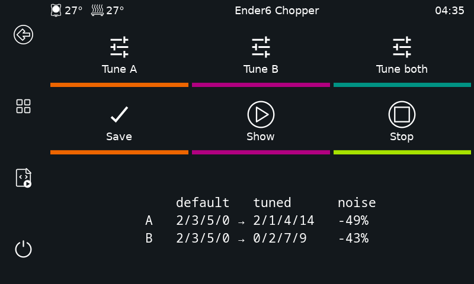
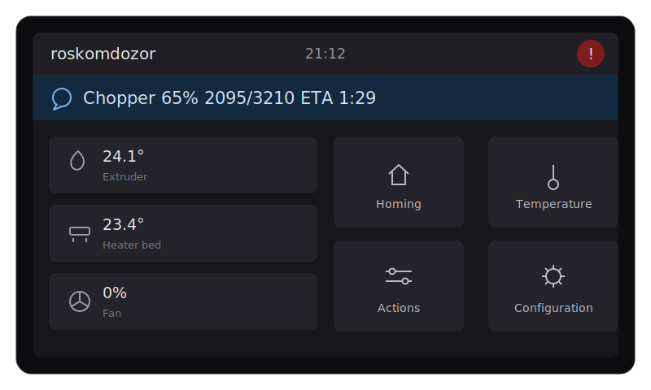

# chopper-autotune

**Полностью автоматический подбор chopper-регистров TMC-драйверов для Klipper по измерениям на реальном железе.**

[English version](README.md)

[](https://github.com/anton-vinogradov/chopper-autotune/actions/workflows/ci.yml)

> **Статус: v0.1.0, проверено на железе.** Полный конвейер работает на реальном принтере (CoreXY, TMC2209, ADXL345); широкое покрытие драйверов и принтеров ещё в начале пути.

## Оглавление

- [Зачем](#зачем)
- [Проблема](#проблема)
- [Подход](#подход) · [как это работает](#как-это-работает-сейчас) · [оценка по даташитам](#оценка-по-даташитам-а-не-только-по-измерениям)
- [Два запуска by design](#два-запуска-by-design)
- [Использование](#использование) · [одна команда](#простой-путь--одна-команда) · [сенсорный экран](#с-сенсорного-экрана--klipperscreen) · [по шагам](#ручной-путь--по-шагам) · [справочник команд](#справочник-команд)
- [Стек](#стек) · [Пререквизиты](#пререквизиты) · [Дорожная карта](#дорожная-карта)
- [Предшественники](#предшественники-и-благодарности) · [Даташиты](#даташиты) · [Лицензия](#лицензия)

## Зачем

- **Одна команда.** `CHOPPER_TUNE SAVE=1` находит резонансную скорость каждого мотора, обыскивает пространство регистров и вписывает победителя в `printer.cfg` за ~20 минут — без чтения графиков и копирования чисел.
- **Меряется на *твоём* железе, а не угадывается.** Каждый кандидат оценивается по реальным данным акселерометра на голове — твои моторы, ремни, напряжение — а не считается из базы.
- **Конкретная цифра.** На эталонном принтере (CoreXY, TMC2209): **−51% вибрации** по мотору A за **8 минут** против дефолтов Klipper, на резонансной скорости.
- **Ради чего вообще тюнить spreadCycle.** Меньше вибрации и слышимого шума, холоднее моторы, чуть больше запаса момента — тот резерв, который универсальные заводские дефолты оставляют на столе.
- **Не разменяет тишину на писк.** Частота чоппера выводится из регистров, поэтому конфиги, уходящие в слышимый диапазон, штрафуются автоматически.
- **Сделано под реальный принтер.** Возобновляемые прогоны, живой прогресс на KlipperScreen, бэкап конфига перед любой записью и `--csv` fallback на случай капризов стриминга.

## Проблема

Значения chopper-регистров (`TBL`, `TOFF`, `HSTRT`, `HEND`, `TPFD`) сильно влияют на поведение шагового мотора: до ~30% разницы в моменте, до 10 раз — в вибрациях, плюс слышимый шум. Оптимум зависит от конкретного мотора, драйвера, напряжения питания и механики — заводские значения из даташита являются компромиссом.

Существующие инструменты оставляют разрыв:

- [chopper-resonance-tuner](https://github.com/MRX8024/chopper-resonance-tuner) и [tmc-chopper-tune](https://github.com/anton-vinogradov/tmc-chopper-tune) — полный перебор сетки регистров (~7000 комбинаций, ~2 часа, ~700 МБ CSV), после чего **человек** глазами выбирает минимум на интерактивном графике. В лучшем случае полуавтоматика.
- [klipper_tmc_autotune](https://github.com/andrewmcgr/klipper_tmc_autotune) — считает регистры аналитически из базы моторов, **вообще без обратной связи от железа**.

## Подход

Замкнуть цикл на реальном железе: *применить регистры → прогнать мотор → измерить вибрации акселерометром на голове → оценить → выбрать следующего кандидата*. Полностью автоматически: от «запустил одну команду» до «вставь этот блок в `printer.cfg`».

### Как это работает сейчас

`tune` связывает всё нижеописанное в одну команду; каждая часть доступна и отдельно:

1. **`find-speed`** проходит диапазон скоростей на текущих регистрах, строит кривую «магнитуда(скорость)», находит резонансные пики (по prominence) и рекомендует скорость для основного прогона.
2. **`collect`** читает всё необходимое из конфига принтера через API-сокет klippy (тип драйвера, текущие регистры, акселерометр, кинематику, границы осей), строит план по сетке регистров/скоростей с отсечением по ограничениям из даташитов, проверяет длину хода против диапазона оси, печатает ETA и просит подтверждение.
3. Принтер выполняет хоуминг XY, паркуется в центре стола и отключает моторы. Для каждой комбинации применяются регистры через `SET_TMC_FIELD`, выполняется `FORCE_MOVE` туда-обратно, а сэмплы акселерометра стримятся напрямую из сокета klippy. Конец каждого движения берётся из `toolhead.print_time`, поэтому в метрику попадает ровно крейсерская фаза — разгон и торможение отрезаются аналитически, а не на глаз.
4. Каждое измерение сразу дописывается в датасет на диске; прерванный прогон возобновляется с места остановки.
5. **`analyze`** агрегирует датасет (среднее по направлениям/итерациям/скоростям — разница fwd/rev это сигнал, поэтому конфиг должен быть тихим в *обе* стороны), штрафует конфигурации с частотой чоппера в слышимом диапазоне, печатает таблицу ранжирования, пишет интерактивный plotly-отчёт и готовый блок для `printer.cfg`; `--apply` применяет победителя на лету без рестарта Klipper.

Кроме полного перебора сетки (по умолчанию), `--search descent` (`SEARCH=descent`) запускает **мультистарт**-спуск в порядке настройки из AN-001 — `TBL`+`TOFF` совместно, затем `HSTRT`, `HEND`, затем `TPFD` — оценивая единицы процентов сетки (минуты вместо часов) и перемеряя топ-кандидатов перед рекомендацией. Несколько стартов, разбросанных по плоскости `TOFF`×`HEND`, не дают жадному поиску застрять: фаза A перебирает `TOFF` при фиксированном `HEND`, поэтому единственный старт с низким `HEND` прячет долину «низкий TOFF / высокий HEND» — старт с нескольких уровней `HEND` даёт её найти. В целевую функцию входит штраф за слышимый чоппер, так что спуск не разменяет чуть меньшую вибрацию на писк 15 кГц. Для второго мотора `SEED_FROM=<датасет>` стартует спуск с победителя первого — подсказка только позиционирует поиск, каждый кандидат всё равно измеряется на целевом моторе, так что разница натяжения ремней и механики учитывается; хорошая подсказка сходится за пару минут, плохая просто стоит обычного времени спуска. Любой записанный grid-датасет — офлайн-полигон: `simulate <dataset>` проигрывает спуск по нему и показывает отставание от истинного оптимума.

### Оценка по даташитам, а не только по измерениям

Акселерометр не «слышит» чоппер (ADXL345 сэмплирует 3.2 кГц), но частота чоппера *вычислима* из регистров и клока драйвера. Это делает классический компромисс «вибрации низкие, но противный высокочастотный писк» автоматическим: кандидаты с частотой чоппера в слышимом диапазоне штрафуются аналитически (`--audible-weight`).

Также по даташитам:

- ограничения пространства поиска (эффективные `HSTRT`+`HEND` ≤ 16 по даташиту, запрет `TOFF` = 0, ограничения blank time для `TOFF` = 1) — отсекаются до какого-либо движения;
- матрица возможностей по драйверам: `TPFD` попадает в сетку только на TMC2240/5160, частоты клока сверены с кодом драйверов Klipper;
- при настроенном `stealthchop_threshold` на время теста принудительно включается spreadCycle с восстановлением после — chopper-регистры действуют только в spreadCycle, в stealthChop мерился бы шум;
- в планах: чтение StallGuard как прокси запаса момента для автоподбора тока мотора.

## Два запуска by design

Инструмент сознательно разделён на две команды, работающие с одним датасетом на диске (`manifest.json` + `measurements.jsonl` + сжатые сырые CSV акселерометра):

1. **`collect`** — медленная часть на железе. Стримит сэмплы из API-сокета klippy (никакой возни с CSV в `/tmp` и износа SD-карты; `--csv` — fallback на классический путь через `ACCELEROMETER_MEASURE`). Прерванный или расширенный прогон возобновляется из той же директории датасета: готовые измерения пропускаются.
2. **`analyze`** — офлайн и мгновенно. Сырые данные сохраняются в датасете, поэтому скоринг можно переделывать и перепроигрывать (`--recompute`) не трогая принтер.

Умные стратегии поиска позже поселятся внутри `collect` и будут выбирать следующую точку онлайн, но датасет остаётся append-only и полным — анализ по-прежнему воспроизводим офлайн.

## Использование

Установка на хосте принтера (в конце Klipper перезапустится):

```
cd ~ && git clone https://github.com/anton-vinogradov/chopper-autotune && bash ./chopper-autotune/install.sh
```

### Простой путь — одна команда

```
CHOPPER_TUNE            ; оба мотора: резонансная скорость + спуск по регистрам, ~20 мин
CHOPPER_TUNE SAVE=1     ; ...и вписать победителей в конфиг (с бэкапом)
```

Это весь workflow: тул находит резонансную скорость каждого мотора, прогоняет на ней спуск по регистрам, второй мотор сеет победителем первого, печатает оба блока для `printer.cfg`, а с `SAVE=1` — сохраняет их и перезапускает Klipper. Прогресс виден на экране принтера; `CHOPPER_STATUS` печатает его в консоль.

### С сенсорного экрана — KlipperScreen

Если у вас есть [KlipperScreen](https://github.com/KlipperScreen/KlipperScreen), `install.sh` добавляет в его подменю **More** кнопку **Chopper** (сливается с вашим меню, ничего не переписывая). Один тап открывает панель:

- **Tune A** / **Tune B** — затюнить один мотор и напечатать рекомендацию (A = `stepper_x`, B = `stepper_y`; chopper — свойство мотора, поэтому это одинаково при любой кинематике, а на CoreXY эти два степпера буквально и есть моторы A и B);
- **Both + Save** — затюнить оба мотора и вписать победителей в конфиг;
- **Demo** — проиграть дефолты драйвера против затюненных регистров на моторе, чтобы *услышать* разницу;
- **Stop** — прервать задачу; перед выходом тул возвращает регистры и делает re-home.

Каждое действие спрашивает подтверждение перед движением принтера. Во время задачи панель показывает живой прогресс, в простое — регистры, сейчас сохранённые для каждого мотора. Кнопки дёргают те же макросы `CHOPPER_*`, так что с экрана доступно всё то же, что из консоли.



### Ручной путь — по шагам

```
CHOPPER_FIND_SPEED                   ; 1. найти резонансные скорости мотора
CHOPPER_COLLECT SPEED=55 DRY_RUN=1   ; посмотреть план и ETA, ничего не двигая
CHOPPER_COLLECT SPEED=55             ; 2. полный перебор сетки на резонансе (часы)
CHOPPER_COLLECT SPEED=55 SEARCH=descent  ; ...или мультистарт-спуск (минуты)
CHOPPER_COLLECT MOTOR=B SPEED=52 SEARCH=descent SEED_FROM=<датасет A>  ; быстрый второй мотор
CHOPPER_STATUS                       ; прогресс и ETA идущего сбора
CHOPPER_ANALYZE                      ; 3. ранжировать свежий датасет, построить отчёт
CHOPPER_ANALYZE APPLY=1              ; применить победителя на лету через SET_TMC_FIELD
CHOPPER_ANALYZE SAVE=1               ; вписать в конфиг и перезапустить Klipper
CHOPPER_DEMO                         ; проиграть дефолты против затюненного, чтобы услышать
```

То же самое по SSH: `chopper-autotune tune|collect|analyze|…`. Каждый параметр макроса отображается 1:1 во флаг CLI (`MEASURE_TIME=1.5` → `--measure-time 1.5`); булевы флаги принимают `1`/`0`. Прогресс идёт двумя путями: `M117` пишет в `display_status.message` (шапка Mainsail/Fluidd, LCD, строка статуса KlipperScreen), а `RESPOND` дублирует каждое обновление в консоль (Mainsail/Fluidd/KlipperScreen) — с префиксом `Chopper:`, а не `echo:`, чтобы KlipperScreen не всплывал уведомление на каждую строку и не перехватывал тапы по панели. Каждый канал сам отключается, если его на принтере нет. Финальная рекомендация остаётся в сообщении дисплея.



Датасеты и HTML-отчёты складываются в `~/printer_data/config/chopper-autotune/datasets/` — видны в файловом менеджере веб-интерфейса. `collect`/`tune` должны запускаться на хосте принтера (общаются с unix-сокетом klippy); `analyze` — где угодно. `uninstall.sh` убирает интеграцию, датасеты остаются.

### Справочник команд

**CHOPPER_TUNE** — весь конвейер; параметры не обязательны.

| параметр | по умолчанию | смысл |
|---|---|---|
| `MOTOR` | `AB` | `A`, `B` или `AB` = оба мотора (A = `stepper_x`, B = `stepper_y`), вторая сеется победителем первой; `x`/`y`/`xy` тоже приняты |
| `SPEED` | авто | пропустить поиск резонанса и тюнить на этой скорости (мм/с) |
| `SAVE` | `0` | вписать победителей в конфиг Klipper (сначала бэкап) и перезапустить |
| `ITERATIONS` | `1` | повторов на кандидата — поднимите на шумной механике |
| `AUDIBLE_WEIGHT` | `0.25` | множитель штрафа за слышимую частоту чоппера |
| `DRY_RUN` | `0` | показать план и ETA, ничего не двигая |

**CHOPPER_FIND_SPEED** — поиск резонансной скорости на текущих регистрах.

| параметр | по умолчанию | смысл |
|---|---|---|
| `MOTOR` | `A` | какой мотор: `a`/`b` (a = `stepper_x`, b = `stepper_y`); `x`/`y` тоже приняты |
| `MIN_SPEED` / `MAX_SPEED` | `20` / `120` | диапазон, мм/с |
| `STEP` | `2` | шаг по скорости, мм/с |
| `ITERATIONS` | `1` | повторов на скорость |
| `MEASURE_TIME` | `1.0` | целевые секунды крейсера на движение (на больших скоростях ужимается под ось) |
| `DATASET` | новый | передайте существующую директорию для возобновления |
| `DRY_RUN` | `0` | только план и ETA |

**CHOPPER_COLLECT** — поиск регистров на заданной скорости.

| параметр | по умолчанию | смысл |
|---|---|---|
| `SPEED` | обязателен | резонансная скорость, мм/с (или диапазон `lo:hi`) |
| `MOTOR` | `A` | какой мотор: `a`/`b` (a = `stepper_x`, b = `stepper_y`); `x`/`y` тоже приняты |
| `SEARCH` | `grid` | `grid` = полный перебор (часы), `descent` = мультистарт-спуск (минуты) |
| `TBL` / `TOFF` / `HSTRT` / `HEND` | `0:3` / `1:8` / `0:7` / `0:15` | диапазоны регистров (`lo:hi` или одно значение) |
| `TPFD` | выкл | диапазон TPFD, только TMC2240/5160 |
| `SEED_FROM` | — | старт спуска с победителя другого датасета (быстрый второй мотор) |
| `SKIP_AUDIBLE` | `0` | исключать пищащие комбинации вместо штрафа |
| `AUDIBLE_WEIGHT` | `0.25` | штраф в целевой функции спуска за слышимый чоппер |
| `ITERATIONS` | `1` | повторов на комбинацию |
| `VALIDATE` | `3` | перемерить топ-N кандидатов дополнительными прогонами перед рекомендацией (`0` = выкл) |
| `MEASURE_TIME` | `1.25` | секунды крейсера на движение |
| `ACCEL` | `max_accel/10` | ускорение движений |
| `TRIM` | `0.1` | защитная доля крейсерского окна (при `CSV=1`: `0.25` от всей записи) |
| `DATASET` | новый | существующая директория = возобновление |
| `NO_RAW` | `0` | не хранить сырые сэмплы (экономит место, отключает `RECOMPUTE`) |
| `CSV` | `0` | классический захват `ACCELEROMETER_MEASURE`+`/tmp` вместо стриминга |
| `DRY_RUN` | `0` | только план и ETA |

**CHOPPER_ANALYZE** — офлайн-ранжирование датасета.

| параметр | по умолчанию | смысл |
|---|---|---|
| `DATASET` | свежайший | какой датасет анализировать |
| `TOP` | `15` | строк в консольной таблице |
| `AUDIBLE_WEIGHT` | `0.25` | штраф ранжирования за слышимый чоппер |
| `RECOMPUTE` | `0` | пересчитать метрики из сырых сэмплов вместо сохранённых |
| `HTML` / `NO_HTML` | `<датасет>/report.html` | путь отчёта / не строить отчёт |
| `APPLY` | `0` | применить победителя на лету через `SET_TMC_FIELD` (до перезагрузки) |
| `SAVE` | `0` | переписать строки `driver_*` в конфиге (сначала бэкап) и перезапустить |

**CHOPPER_DEMO** — проигрывает дефолтные регистры драйвера против сохранённых/затюненных на моторе на резонансной скорости, чередуя, чтобы *услышать* разницу, объявляя каждый заход на экране и в консоли. `MOTOR` (a/b), `SPEED` (авто, если опущен), `ROUNDS`, `REPEATS`. `REPORT=1` печатает замер с числами (во сколько раз тише, с барами) вместо звукового шоу; `DEFAULT=tbl,toff,hstrt,hend` (по умолчанию `2,3,5,0`) и `ITERATIONS` — для замера.

**CHOPPER_STATUS** — прогресс свежайшего (или `DATASET=`) прогона; `TOTAL=` задаёт плановое число движений для старых датасетов.

Только в CLI: `chopper-autotune simulate <grid-датасет>` (офлайн-replay спуска с отставанием от истинного оптимума) и `chopper-autotune compare <A> <B>` (победители, ранговая корреляция, пересечение топов). Экспертные флаги `SOCKET=`/`URL=` переопределяют путь к сокету klippy и адрес Moonraker.

## Стек

Python 3.9+ на хосте принтера. API-сокет klippy для оркестрации и стриминга сэмплов (без Jinja-циклов в макросах; Moonraker HTTP — только для `analyze --apply`), `numpy` для метрик, plotly для отчётов; поиск пиков через `scipy` и Optuna-поиск — в планах.

## Пререквизиты

- Klipper + Moonraker (Mainsail, Fluidd или любой другой фронтенд).
- Поддерживаемый TMC-драйвер на настраиваемом моторе (список с даташитами ниже).
- **Акселерометр на печатающей голове** — измерительный инструмент всего тула:
  - подойдёт любой чип, который поддерживает резонансный стек Klipper: ADXL345 (классика), LIS2DW, семейство MPU-9250; USB-свистки (KUSBA, FYSETC PIS) и CAN-платы головы со встроенным чипом (EBB36/42, SB2209, …) тоже считаются;
  - крепить **жёстко к голове** (винтом, не скотчем) — ровно как для калибровки input shaper;
  - проводка и конфигурация (`[adxl345]` + `[resonance_tester]`) описаны в клипперовском гайде [Measuring Resonances](https://www.klipper3d.org/Measuring_Resonances.html); справочник конфига: [adxl345](https://www.klipper3d.org/Config_Reference.html#adxl345), [resonance_tester](https://www.klipper3d.org/Config_Reference.html#resonance_tester). Чип тул берёт из `[resonance_tester] accel_chip` автоматически (по умолчанию `adxl345`);
  - проверка перед тюнингом: `ACCELEROMETER_QUERY` возвращает показания, а `MEASURE_AXES_NOISE` — около или ниже ~100;
  - в отличие от штатных шейпер-инструментов Klipper, chopper-autotune **не** требует numpy внутри klippy-env — сэмплы стримятся наружу и считаются в собственном venv тула.

## Дорожная карта

- [x] Двухфазный дизайн: `collect` (железо, возобновляемый датасет) / `analyze` (офлайн, воспроизводимо)
- [x] Измерительный примитив поверх API-сокета klippy (регистры → `FORCE_MOVE` → стрим сэмплов)
- [x] Перебор сетки с ограничениями из даташитов, TPFD на TMC2240/5160
- [x] Модель частоты чоппера и штраф за слышимый диапазон (первое приближение)
- [x] Макросы веб-консоли (`CHOPPER_COLLECT`/`CHOPPER_ANALYZE`), инсталлятор, update_manager Moonraker
- [x] Стриминг сэмплов с точной нарезкой крейсерской фазы (`--csv` fallback)
- [x] Проверка на реальном принтере (CoreXY, TMC2209, ADXL345: стрим и CSV-путь согласуются)
- [x] Автоматический поиск резонансной скорости (`find-speed`, пики по prominence)
- [x] Принудительный spreadCycle на время теста при настроенном `stealthchop_threshold`; `CHOPPER_STATUS` прогресс/ETA
- [x] Одна команда `CHOPPER_TUNE` на весь конвейер (поиск скорости → спуск по осям → батчевый `SAVE=1`)
- [x] Мультистарт покоординатный спуск (`--search descent`: порядок AN-001, старты по плоскости TOFF×HEND против несепарабельной слепой зоны, штраф за писк, офлайн-replay через `simulate`)
- [ ] Optuna/TPE-стратегия, ранний abort плохих кандидатов посреди движения
- [x] Фаза валидации: топ-кандидаты перемеряются дополнительными прогонами перед рекомендацией (grid и descent)
- [ ] Автоподбор тока по StallGuard

## Предшественники и благодарности

- [MRX8024/chopper-resonance-tuner](https://github.com/MRX8024/chopper-resonance-tuner) — оригинальная методика измерений
- [anton-vinogradov/tmc-chopper-tune](https://github.com/anton-vinogradov/tmc-chopper-tune) — упрощённый форк, прямой предшественник
- [andrewmcgr/klipper_tmc_autotune](https://github.com/andrewmcgr/klipper_tmc_autotune) — аналитический подход (без измерений)
- Trinamic [AN-001: Parameterization of spreadCycle](https://www.analog.com/en/app-notes/AN-001.html)

## Даташиты

- TMC2130 [datasheet](https://www.analog.com/media/en/technical-documentation/data-sheets/TMC2130_datasheet_rev1.15.pdf) · Klipper [config](https://www.klipper3d.org/Config_Reference.html#tmc2130)
- TMC2208 [datasheet](https://www.analog.com/media/en/technical-documentation/data-sheets/TMC2202_TMC2208_TMC2224_datasheet_rev1.14.pdf) · Klipper [config](https://www.klipper3d.org/Config_Reference.html#tmc2208)
- TMC2209 [datasheet](https://www.analog.com/media/en/technical-documentation/data-sheets/TMC2209_datasheet_rev1.09.pdf) · Klipper [config](https://www.klipper3d.org/Config_Reference.html#tmc2209)
- TMC2660 [datasheet](https://www.analog.com/media/en/technical-documentation/data-sheets/TMC2660C_Datasheet_Rev1.01.pdf) · Klipper [config](https://www.klipper3d.org/Config_Reference.html#tmc2660)
- TMC2240 [datasheet](https://www.analog.com/media/en/technical-documentation/data-sheets/tmc2240_datasheet.pdf) · Klipper [config](https://www.klipper3d.org/Config_Reference.html#tmc2240)
- TMC5160 [datasheet](https://www.analog.com/media/en/technical-documentation/data-sheets/TMC5160A_datasheet_rev1.17.pdf) · Klipper [config](https://www.klipper3d.org/Config_Reference.html#tmc5160)

## Лицензия

[MIT](LICENSE.TXT)
